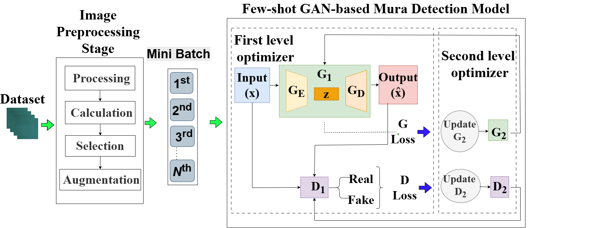

# A Few-Shot based Mura Detection Model with Unsupervised Adversarial Learning

### Official tensorflow implementation of the research: A Few-Shot based Mura Detection Model with Unsupervised Adversarial Learning

## Abstract

Mura is the defect of display panels, which refers to visual irregularities found on the panel's surface.
Mura is challenging to detect because of its uncommon form, size, and low contrast, so a Mura inspection should be carried out during display quality testing.
In the production line, normal images (panels without Mura) are rare because it is almost impossible for a machine to produce a display panel with perfect precision in the combination of layers.
The goal of the Mura detection model is to differentiate between light Mura and serious Mura.
Detecting light and serious Mura with conventional detection methods have the following problems: (1) data imbalance and (2) no accurate representations of the feature space can be made for Mura.
Light Mura and serious Mura are almost impossible to distinguish because they share similar features.
This study develop a few-shot-based Mura detection model with unsupervised adversarial learning to address these issues.
Essentially, the model consists of two level optimizer: the first and second levels.

The weight parameters of the first-level generator $G_1$ and discriminator $D_1$ are inherited to initialize the second-level generator $G_2$ and discriminator $D_2$.
In the second-level optimizer, the generator $G_2$ is trained using adversarial, Charbonnier, and multi-feature losses to enhance feature representations progressively.
Meanwhile, discriminator $D_2$ is optimized using adversarial and Charbonnier losses.
This combination obtains the best result in this study.
The second-level optimizer effectively enhances the model’s adaptability layer by layer.
The accuracy of the reconstruction will be determined by developing a reconstruction error score, and by using that score, defects in the sample will be assessed, thus achieving anomaly detection.



### Installation

```bash
$ git clone git@github.com:sallylinlab/UF_GAN
$ cd few-shot-GAN
$ python -m pip install -r requirements.txt
```


### Train

```bash
$ python main.py --help
```

```
usage: main.py [-h] [-aw ANOMALY_WEIGHT] [-lr LEARNING_RATE] [-metastep META_STEP_SIZE] [-bs BATCH_SIZE] [-metaiter META_ITERS] [-ii INNER_ITERS] [-ei EVAL_INTERVAL] [-dn DATASET_NAME]
               [-sz SIZE] [-ss STEP_SLIDING] [-ws WIN_SIZE] [-s SHOTS] [-nd NO_DATASET] [-m MODE] [-rtd ROOT_DATA_DIR] [-ted TEST_DATA] [-trd TRAIN_DATA] [-eld EVAL_DATA] [-rd RESULT_DIR]
               [-smd SAVED_MODEL_DIR] [-bmw BEST_MODEL_WEIGHT] [-ks KERNEL_SIZE]

optional arguments:
  -h, --help            show this help message and exit
  -aw ANOMALY_WEIGHT, --ANOMALY_WEIGHT ANOMALY_WEIGHT
                        Anomaly weight in range 0-9 (default: 0.7)
  -lr LEARNING_RATE, --LEARNING_RATE LEARNING_RATE
                        Learning rate (default: 0.002)
  -metastep META_STEP_SIZE, --META_STEP_SIZE META_STEP_SIZE
                        Meta step size (default: 0.25)
  -bs BATCH_SIZE, --BATCH_SIZE BATCH_SIZE
                        Batch size (default: 25)
  -metaiter META_ITERS, --META_ITERS META_ITERS
                        Meta iterations / outer (default: 1500)
  -ii INNER_ITERS, --INNER_ITERS INNER_ITERS
                        Inner iterations / inner (default: 4)
  -ei EVAL_INTERVAL, --EVAL_INTERVAL EVAL_INTERVAL
                        Evaluation interval per number of iteration(default: 100)
  -dn DATASET_NAME, --DATASET_NAME DATASET_NAME
                        Name of dataset in data directory. (default: mura)
  -sz SIZE, --SIZE SIZE
                        Size of cropped image. (default: 128)
  -ss STEP_SLIDING, --STEP_SLIDING STEP_SLIDING
                        Step size (default: 20)
  -ws WIN_SIZE, --WIN_SIZE WIN_SIZE
                        Step size (default: 128)
  -s SHOTS, --SHOTS SHOTS
                        Number of data that you want to use. (default: 20)
  -nd NO_DATASET, --NO_DATASET NO_DATASET
                        Select which number of dataset. (default: 0)
  -m MODE, --MODE MODE  Mode. Train (True) or Only Test (False) (default: True)
  -rtd ROOT_DATA_DIR, --ROOT_DATA_DIR ROOT_DATA_DIR
                        Root directory of data (default: data)
  -ted TEST_DATA, --TEST_DATA TEST_DATA
                        Directory of test data (default: test_data)
  -trd TRAIN_DATA, --TRAIN_DATA TRAIN_DATA
                        Directory of train data (default: train_data)
  -eld EVAL_DATA, --EVAL_DATA EVAL_DATA
                        Directory of evaluation data (default: eval_data)
  -rd RESULT_DIR, --RESULT_DIR RESULT_DIR
                        Directory of result (default: result)
  -smd SAVED_MODEL_DIR, --SAVED_MODEL_DIR SAVED_MODEL_DIR
                        Directory of saved_model (default: saved_model)
  -bmw BEST_MODEL_WEIGHT, --BEST_MODEL_WEIGHT BEST_MODEL_WEIGHT
                        Using the best model weight (default: True)
  -ks KERNEL_SIZE, --KERNEL_SIZE KERNEL_SIZE
                        Kernel size in generator decoder. (default: 4)
```

```bash
$ python main.py --MODE true --DATASET_NAME mura --SHOTS 20 --SIZE 128 --META_ITERS 1500
```

Common training options:
```
--MODE                  Mode. Train (True) or Only Test (False) (default: True)
--DATASET_NAME          name of dataset in data directory. (default: mura)
--SIZE                  size of cropped image of training. (default:128)
--SHOTS                 number of data that you want to use. (default:20)
--META_ITERS            Meta iterations (default: 1500)
--BEST_MODEL_WEIGHT     Using the best model weight if false model will use the last weight after training end. (default: True)
```

you can check and execute `run.sh` for easier execution.
```bash
$ bash run.sh
```

### Test
```bash
$ python main.py --MODE False --DATASET_NAME mura --SHOTS 20 --SIZE 128 --META_ITERS 1500 --BEST_MODEL_WEIGHT true
```
<em>***Make sure that the configuration & arguments of the model you want to test are the same as the training stage.
</em>

### Citation
If you use this code for your research, please cite our paper.

### Code Exploring
If you want to explore this code, start from `main.py`.
Based on the structure of `main.py` will guide you to be able to understand this code more efficiently.

## Acknowledgements
The implementation is based on the architecture of [Res-unetGAN](https://ieeexplore.ieee.org/document/9389548).
Thanks them for their great work!. Don't hesitate to drop e-mail if you have any problem.
